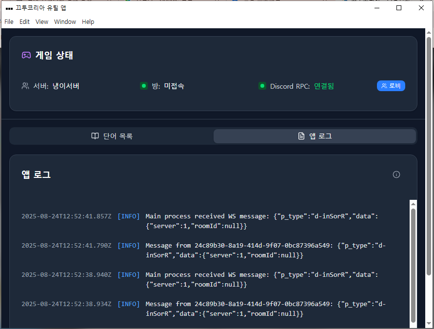
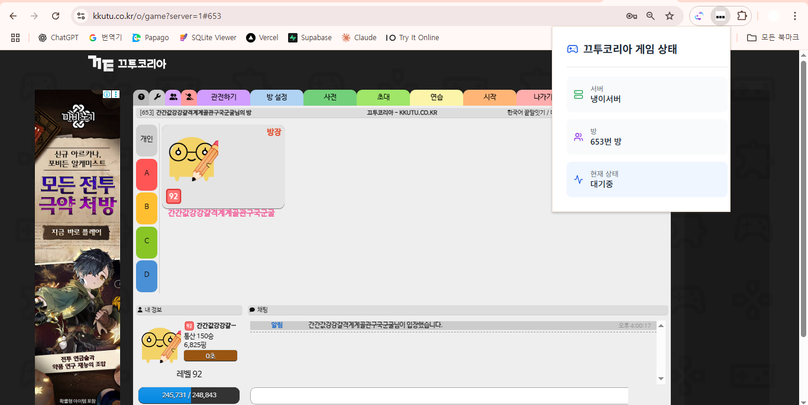
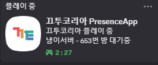
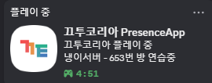
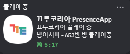
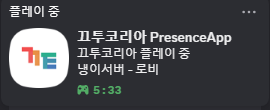
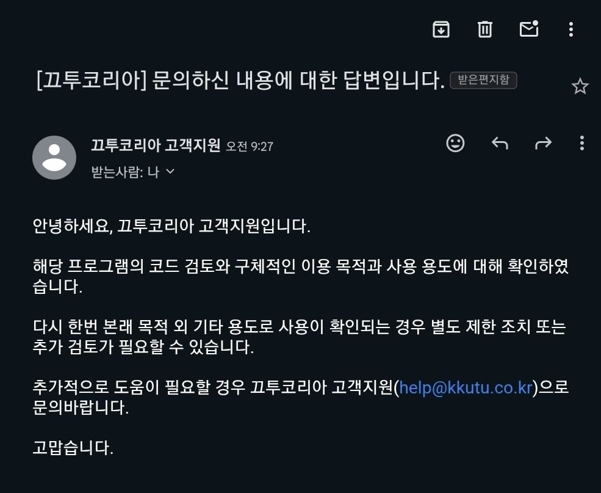
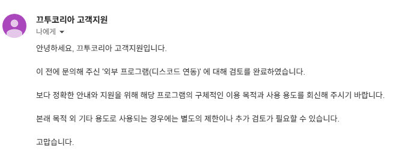

# 끄투코리아 Discord RPC

끄투코리아에서 게임을 플레이할 때 Discord 상태에 실시간으로 게임 정보를 표시해주는 앱입니다.

## ✨ 소개

끄투코리아는 끝말잇기, 쿵쿵따, 앞말잇기 등 다양한 한국어 단어 게임을 즐길 수 있는 인기 웹게임입니다. 이 앱을 통해 Discord 친구들에게 현재 끄투코리아를 플레이 중인 상태를 자동으로 공유할 수 있습니다.

## 🚀 주요 기능

- **실시간 상태 업데이트**: 현재 플레이 중인 게임 모드 표시
- **단어 자동 수집**: 게임중 단어를 자동으로 수집해 좋은 단어를 놓치지 않게 됩니다.

### Discord에 표시되는 정보
- 현재 접속중인 서버, 방번호
- 플레이 시간
- 게임 진행 상황

## 📥 설치&업데이트 방법

### Windows
[이 문서](./docs/install_window.md)를 확인해주세요.  
[앱 자동 시작 설정 방법](./docs/autostart_window.md)도 확인해주세요.

### macOS
추후 지원 예정

### Linux
추후 지원 예정

## 🎯 사용법

1. **Discord 실행**: 먼저 Discord가 실행되어 있어야 합니다
2. **앱 실행**: 설치한 끄투코리아 Discord RPC 앱을 실행합니다
3. **끄투코리아 접속**: [끄투코리아](https://kkutu.co.kr) 웹사이트에 접속합니다
4. **게임 시작**: 원하는 게임 방에 입장하여 게임을 시작합니다
5. **상태 확인**: Discord 프로필에서 게임 상태가 자동으로 업데이트되는 것을 확인합니다.

### 사용 예시

## ⚙️ 요구 사항

- **운영체제**: Windows 10+ / macOS 현재 미지원 / Ubuntu 현재 미지원
- **Discord**: Discord 데스크톱 앱 설치 필요
- **브라우저**: Chrome, Edge 브라우저, 현재 Firefox, Safari은 미지원입ㄴ다.
- **네트워크**: 인터넷 연결 필요

## 🔧 문제 해결

### Discord에 상태가 표시되지 않는 경우
1. Discord가 정상적으로 실행되어 있는지 확인하세요
2. Discord 설정에서 "게임 활동"이 활성화되어 있는지 확인하세요
3. 앱을 재시작해보세요

### 게임이 자동 감지되지 않는 경우
1. 끄투코리아 웹사이트에 완전히 로그인되어 있는지 확인하세요
2. 브라우저를 새로고침해보세요
3. 익스텐션이 활성화되고 있는지 확인하세요.

## 🤝 기여하기

버그 리포트, 기능 제안, 코드 기여를 환영합니다!
[깃허브 이슈](https://github.com/hafskjfha/kkuko-extension-download/issues)를 사용해주세요. 혹은 디스코드 개인 dm부탁드립니다.

기능 제안 - 끄투코리아 운영약관 내의 기능만 가능함.

## 📄 라이선스

이 프로젝트는 GPL-3 라이선스 하에 배포됩니다. 자세한 내용은 [LICENSE](LICENSE) 파일을 참조하세요.

## 📞 연락처

- **이메일**: jtw7913@example.com
- **GitHub**: [@hafskjfha](https://github.com/hafskjfha)

## 🙏 감사의 말

- [끄투코리아](https://kkutu.co.kr) 팀에게 훌륭한 게임을 제공해주셔서 감사합니다
- Discord RPC 라이브러리 개발자들에게 감사합니다

## 끄투코리아
프로그램을 검토해주신 끄투코리아팀에게 감사합니다.

---

⭐ 이 프로젝트가 유용하다면 스타를 눌러주세요!