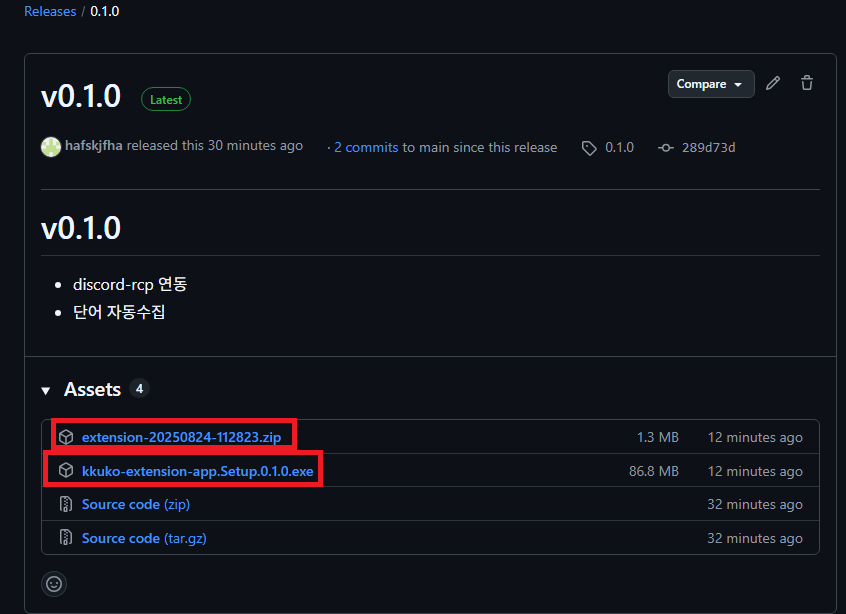
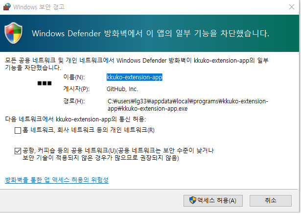
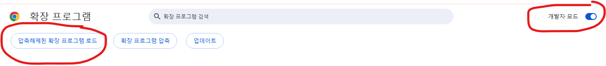
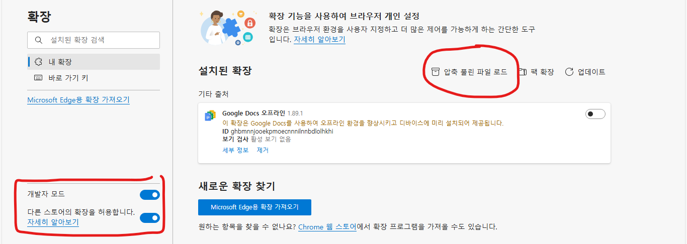
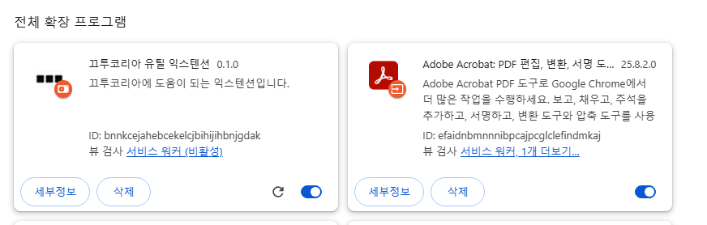

# 윈도우설치 방법

1. [깃허브 릴리즈(여기 클릭)](https://github.com/hafskjfha/kkuko-extension-download/releases/latest)에서 최신버전 setup.version.exe과 extension-.zip을 다운 받습니다.

(버전 0.1.0 예시)

2. exe파일을 실행합니다.  
⚠️ 주의 사항 !
 항상 백신이 실행중인지 확인하세요. 혹시나 프로그램이 위조 / 오염 될 수 있습니다 <nr>

설치후 자동실행이 될텐데 방화벽 경고가 뜬다면 **액세스허용** 을 눌러주세요.
앱내부에서 웹소켓 서버를 사용하기에 켜야지 웹소켓 서버가 켜집니다.

3. 다운로드 받은 .zip파일의 압축을 풉니다.
4.  
- [크롬 익스텐션 홈](chrome://extensions/)
- [엣지 익스텐션 홈](edge://extensions/)
  에 접속을 합니다. 파이어폭스는 지원예정입니다.

5. 익스텐션을 추가합니다
    크롬
    엣지   
   **주의 사항**: 개발자 모드를 체크해야지 확장프로그램을 로드할 수 있습니다.
6. 끄투코리아 유틸 익스텐션이 보인다면 성공입니다.
   